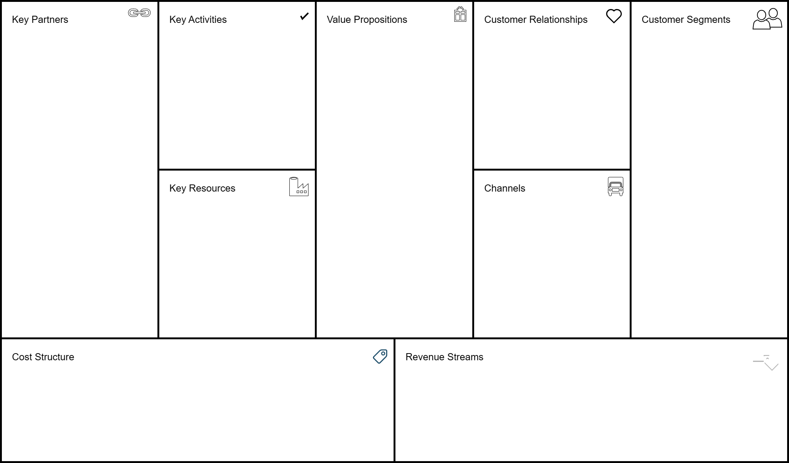

## Lab1-项目启动

### 项目总览

#### 项目选题

本小组致力于开发一款智能化生成plog的平台M·A·P。

#### 项目成员

| 姓名 | 学号 |
| ---- | ---- |
| 张铭铭（队长） | 211250234 |
| 陈皓鑫 | 211250236 |
| 张哲恺 | 211250245 |

#### 项目简介

你是否曾在刷小红书、b站等社交媒体平台时，看着众多博主的精美plog或封面而心生羡意？或是曾在某个想要分享自己的生活，经验或攻略的时刻，看着平庸的排版而默默删除了草稿？抑或是已经写好文案，准备好图片，打开设计软件准备大干一场，却被繁忙的生活打断而一再搁置？甚至是上传了精心设计一番的内容，每隔一段时间就拿出手机看看自己有没有收到新的回复和点赞，却被惨淡的浏览量来上当头一棒？

在当今大众分享的网络环境之下，越来越多的用户从receiver转变成为uploader，越来越多的人希望向互联网上的大家分享自己的生活和经验，然而，相似甚至相同的内容在不同的排版设计之下，浏览量却大相径庭。为了让普通用户也能轻松地创作出精美的plog，成为一名精致的博主，小组致力于开发的M·A·P项目以高质量的图片生成、智能推荐引擎为核心，以社区、模板制作等功能作为辅助，希望帮助用户降低分享难度，节省创作时间，将创作者的精力集中于内容而非排版之上。

平台的核心是一款高质量的图片生成和智能推荐引擎，用户输入自己希望分享的文本和图片，以及希望生成图片的标签类型，引擎通过智能推荐算法选择合适的模板，根据模板在合适的位置嵌入图片和文字，并根据图片对模板作出适当调整后，将生成的备选项返回给用户。为确保生成的图片能满足用户的需要，用户可以进一步提出要求，引擎根据要求再次寻找、生成并返回。例如，如果用户希望使用平台生成旅游的一图流攻略，并上传了数个景点的照片，简要介绍和景点间的交通方式，并选择旅游、攻略的标签，系统就会自动选择数个适合旅游攻略的图片模板，将图片、文字嵌入到模板的合适位置，然后将生成的数个图片返回给用户，供用户挑选或进一步提出限制要求，由系统进一步生成。

同时，考虑到人工智能生成的图片并不一定能完美地符合用户的需要，平台也支持用户对生成的候选项进行手动调整并导出，支持用户手动选择想要使用的图片模板。进一步而言，考虑到平台已经储备的模板并不一定能满足所有用户对于所有情况的需要，所以平台的社区功能支持用户上传自己制作的模板供其他用户使用，支持用户关注模板的提供者，支持用户为精美的模板进行点赞、收藏和转发，如此既可以满足为创作者提供创作并从中获利的平台，也能方便使用者通过平台获取精美、多样、不断更新的模板和图片。

为保证创作的便捷性，创作模板的过程只需要创作者设计或直接使用相应的组件，将其拖拽到期望的位置后即可完成模板的创作。为了方便使用者浏览模板，创作者也可以在组件中加入示例图片和文字展示模板的使用效果。用户在手动对生成的模板进行调整的过程中，只需要选中相应的组件，替换它的图片或文字，更改它的位置即可。

我们的项目致力于用户创作和使用的便捷性，希望让每一位使用者都能通过它得到满意的plog或视频的封面，让每一位uploader都能轻松地成为一名精致的博主，助力于提升用户的分享体验和分享质量，为让用户自信地分享自己的生活而不懈努力。

#### 竞品介绍

##### 竞品——美图秀秀

美图秀秀是由厦门美图网科技有限公司开发的一款图像处理软件，于2008年上线，是一款集拍照、美化、分享、社交于一体的手机图像处理软件。美图秀秀针对图片处理和摄影等方面，拥有图片特效、人像美容、拼图等功能，能为用户提供智能拍照、修图服务。该软件最初仅为单纯的图像处理软件，后来逐渐扩展社交功能，将自身定位为“潮流美学发源地”，从影像工具软件升级为综合社区平台。

##### 竞品——Canva可画

Canva是一款由澳大利亚公司开发的在线平面设计工具，于2012年发布。Canva提供了一系列的设计工具和模板，用户可以使用这些工具和模板来设计海报、名片、社交媒体图像等。Canva分为免费版、付费版和企业版，免费版提供了大量的模板和设计工具，但是需要付费才能使用部分高级功能。Canva的付费版和企业版提供了更多的模板和设计工具，同时还提供了团队协作功能。2018年， Canva已面向中国市场正式推出中文版产品。

##### 竞品——Photoshop

Adobe Photoshop，通常简称为Photoshop，是由Adobe公司开发的一款图像编辑和处理软件。从其1990年首次发布以来，Photoshop已经成为图像编辑领域的行业标准。Photoshop为用户提供了一系列强大的图像编辑工具，包括修复照片、调整颜色、裁剪、图层管理、添加特效和滤镜等。它的一个核心特性是它的图层系统。用户可以在单独的图层上工作，然后将它们组合成一个完整的图像，这为复杂的图像编辑和合成提供了很大的灵活性。由于其复杂性和功能的丰富性，Photoshop有一个相对较陡的学习曲线，但也有大量的在线教程、视频和书籍供初学者学习。常用于广告设计、摄影后期、Web设计、游戏设计、电影特效等多个领域。

##### 最佳竞品与原因

本小组选择的最佳竞品是美图秀秀，选择美图秀秀的原因如下：

- 产品定位：美图秀秀相比Canva和Photoshop而言，其产品的定位更倾向于让使用者方便快捷地完成图片的美化与设计，与本小组的项目定位相似
- 消费市场：美图秀秀的上手难度低、宣传策略、设备要求、发行地域等因素，使得美图秀秀的消费者市场规模远远大于Canva和Photoshop

### 最佳竞品分析

#### 商业画布

##### 度量数值

##### 客户细分

- 普通用户

    普通用户的主体为普通网民。他们使用美图秀秀来进行美化或编辑图片，然后在社交媒体上上传进行社交。

- 平台博主
  
    平台博主通过美图秀秀，可以对创作内容进行美化和编辑，然后上传到b站或小红书等平台上分享。
- 宣传工作者，设计师
  
    宣传工作者，设计师，通过美图秀秀可以设计海报，宣传物资来完成自己的工作。
- 修图博主

    修图博主在美图秀秀上的社区分享自己的修图技巧和素材。
- 修图工作者
  
    修图工作者在美图秀秀的社区或其他平台上接受修图的任务，通过美图秀秀完成修图工作并以此盈利。

##### 价值主张

- 新潮

    美图秀秀的自身定位为“潮流美学发源地”，主打一个迎合当下流行风潮。当用户需要一些图片美化素材时，很多情况下，简单朴素的贴纸和滤镜已经不能满足用户的需求，用户需要一些更加符合当下流行审美的素材来美化自己的作品。美图秀秀经常对自己的素材库进行更新，根据时下朋友圈或微博等流行内容，推出新的图片美化配方。
- 便利性
  
    美图秀秀的操作简单，即使是完全没有接触过的用户也可以在短时间内轻松上手。用户可以通过简单的拖拽，点击等操作，就可以完成对图片的美化和编辑。
- 定制化

    除了最基本的图片美化选项，美图秀秀还提供了一系列基于图片美化而衍生的更细化的功能，如“帮我修图”、“魔法照片”、“朋友圈9图”等。这些功能为用户提供了更丰富的定制化选项，方便用户根据自己的需求，对图片进行更加细致的美化和编辑。
- 创新性

    美图秀秀的公司已成立核心研发部门，致力于计算机视觉、深度学习、计算机图形学等人工智能（AI）相关领域的研发，以核心技术创新推动业务发展，让美图秀秀拥有诸如AI扩图、AI设计等更具创新性、智能性的功能。

##### 渠道通路

##### 客户关系

##### 收入来源

- 工具使用费

    美图秀秀上的部分功能强大的图片编辑工具，如AI工具，需要付费才能使用。
- 会员费

    美图秀秀上的一些特定素材与模板内容，需要开通会员才能使用。
- 广告费

    美图秀秀通过允许企业在其社区中投放广告以获取广告费。

##### 核心资源

##### 关键业务

##### 重要合作

- 图片素材供应商

    美图秀秀需要与图片素材供应商或版权方合作，获取图片素材。通过与一些素材供应商合作，一方面供应商通过本平台可获得更多流量，并收取相关费用，另一方面本平台可获得更多素材资源，提升用户体验。

- 创作者和设计师

    美图秀秀与一些设计师和创作者合作，请这些专业的、有经验的设计师入驻平台。通过诸如“帮我修图”等功能，这些人可以为用户提供付费的图片美化和编辑服务。

- 流行品牌战略合作

    美图秀秀与一些知名品牌达成战略合作关系，例如：与Dior迪奥达成合作，携手打造Dior迪奥AI美妍测肤功能；与屈臣氏尝试AI新零售，在线下销售店内引入“美图魔镜”。与这些品牌的合作可以使双方都获得更多的流量，从而实现互惠互赢。

##### 成本结构

- 前期成本
  
    前期成本包括，产品前期聘请开发人员的成本，初期调研市场和测试的成本等。
- 运营成本

    营运成本包括，软件上线后的运维人员成本，服务器和数据库成本，部分素材的版权费用，维护社区氛围人员以及客服的成本。
- 技术成本

    技术成本包括，图片美化算法的开发，图像识别算法的开发，AI绘画与AI设计等AI工具的研发。
- 营销成本

    营销成本包括，在社交媒体上投放广告的费用，以及请平台博主进行推广的推广费。

### 要点关联

#### 横向联系

##### 客户细分—价值主张的联系

#### 纵向联系

##### 核心资源—关键业务—成本结构的联系

##### 客户细分—收入来源的联系

##### 重要合作—成本结构的联系

#### 跨越的联系

##### 客户关系-成本结构的联系

##### 渠道通路-核心资源的联系

##### 渠道通路-重要合作的联系

##### 价值主张-重要合作的联系

#### 联系的联系

##### 多个价值主张-客户细分的联系

### 问题域
