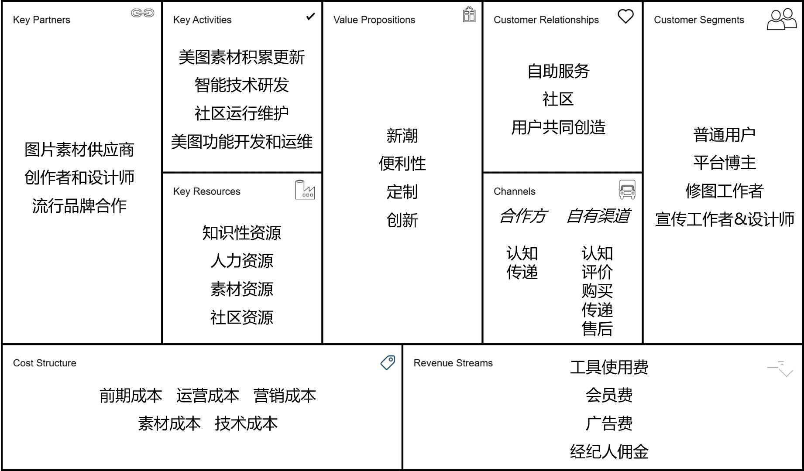

## Lab1-项目启动

### 项目总览

#### 项目选题

本小组致力于开发一款智能化生成plog的平台M·A·P。

#### 项目成员

| 姓名 | 学号 |
| ---- | ---- |
| 张铭铭（队长） | 211250234 |
| 陈皓鑫 | 211250236 |
| 张哲恺 | 211250245 |

#### 项目简介

你是否曾在刷小红书、b站等社交媒体平台时，看着众多博主的精美plog或封面而心生羡意？或是曾在某个想要分享自己的生活，经验或攻略的时刻，看着平庸的排版而默默删除了草稿？抑或是已经写好文案，准备好图片，打开设计软件准备大干一场，却被繁忙的生活打断而一再搁置？甚至是上传了精心设计一番的内容，每隔一段时间就拿出手机看看自己有没有收到新的回复和点赞，却被惨淡的浏览量来上当头一棒？

在当今大众分享的网络环境之下，越来越多的用户从receiver转变成为uploader，越来越多的人希望向互联网上的大家分享自己的生活和经验，然而，相似甚至相同的内容在不同的排版设计之下，浏览量却大相径庭。为了让普通用户也能轻松地创作出精美的plog，成为一名精致的博主，小组致力于开发的M·A·P项目以高质量的图片生成、智能推荐引擎为核心，以社区、模板制作等功能作为辅助，希望帮助用户降低分享难度，节省创作时间，将创作者的精力集中于内容而非排版之上。

平台的核心是一款高质量的图片生成和智能推荐引擎，用户输入自己希望分享的文本和图片，以及希望生成图片的标签类型，引擎通过智能推荐算法选择合适的模板，根据模板在合适的位置嵌入图片和文字，并根据图片对模板作出适当调整后，将生成的备选项返回给用户。为确保生成的图片能满足用户的需要，用户可以进一步提出要求，引擎根据要求再次寻找、生成并返回。例如，如果用户希望使用平台生成旅游的一图流攻略，并上传了数个景点的照片，简要介绍和景点间的交通方式，并选择旅游、攻略的标签，系统就会自动选择数个适合旅游攻略的图片模板，将图片、文字嵌入到模板的合适位置，然后将生成的数个图片返回给用户，供用户挑选或进一步提出限制要求，由系统进一步生成。

同时，考虑到人工智能生成的图片并不一定能完美地符合用户的需要，平台也支持用户对生成的候选项进行手动调整并导出，支持用户手动选择想要使用的图片模板。进一步而言，考虑到平台已经储备的模板并不一定能满足所有用户对于所有情况的需要，所以平台的社区功能支持用户上传自己制作的模板供其他用户使用，支持用户关注模板的提供者，支持用户为精美的模板进行点赞、收藏和转发，如此既可以满足为创作者提供创作并从中获利的平台，也能方便使用者通过平台获取精美、多样、不断更新的模板和图片。

为保证创作的便捷性，创作模板的过程只需要创作者设计或直接使用相应的组件，将其拖拽到期望的位置后即可完成模板的创作。为了方便使用者浏览模板，创作者也可以在组件中加入示例图片和文字展示模板的使用效果。用户在手动对生成的模板进行调整的过程中，只需要选中相应的组件，替换它的图片或文字，更改它的位置即可。

我们的项目致力于用户创作和使用的便捷性，希望让每一位使用者都能通过它得到满意的plog或视频的封面，让每一位uploader都能轻松地成为一名精致的博主，助力于提升用户的分享体验和分享质量，为让用户自信地分享自己的生活而不懈努力。

#### 竞品介绍

##### 竞品——美图秀秀

美图秀秀是由厦门美图网科技有限公司开发的一款图像处理软件，于2008年上线，是一款集拍照、美化、分享、社交于一体的手机图像处理软件。美图秀秀针对图片处理和摄影等方面，拥有图片特效、人像美容、拼图等功能，能为用户提供智能拍照、修图服务。该软件最初仅为单纯的图像处理软件，后来逐渐扩展社交功能，将自身定位为“潮流美学发源地”，从影像工具软件升级为综合社区平台。

##### 竞品——Canva可画

Canva是一款由澳大利亚公司开发的在线平面设计工具，于2012年发布。Canva提供了一系列的设计工具和模板，用户可以使用这些工具和模板来设计海报、名片、社交媒体图像等。Canva分为免费版、付费版和企业版，免费版提供了大量的模板和设计工具，但是需要付费才能使用部分高级功能。Canva的付费版和企业版提供了更多的模板和设计工具，同时还提供了团队协作功能。2018年， Canva已面向中国市场正式推出中文版产品。

##### 竞品——Photoshop

Adobe Photoshop，通常简称为Photoshop，是由Adobe公司开发的一款图像编辑和处理软件。从其1990年首次发布以来，Photoshop已经成为图像编辑领域的行业标准。Photoshop为用户提供了一系列强大的图像编辑工具，包括修复照片、调整颜色、裁剪、图层管理、添加特效和滤镜等。它的一个核心特性是它的图层系统。用户可以在单独的图层上工作，然后将它们组合成一个完整的图像，这为复杂的图像编辑和合成提供了很大的灵活性。由于其复杂性和功能的丰富性，Photoshop有一个相对较陡的学习曲线，但也有大量的在线教程、视频和书籍供初学者学习。常用于广告设计、摄影后期、Web设计、游戏设计、电影特效等多个领域。

##### 最佳竞品与原因

本小组选择的最佳竞品是美图秀秀，选择美图秀秀的原因如下：

- 产品定位：美图秀秀相比Canva和Photoshop而言，其产品的定位更倾向于让使用者方便快捷地完成图片的美化与设计，与本小组的项目定位相似。
- 消费市场：美图秀秀的上手难度低、宣传策略、设备要求、发行地域等因素，使得美图秀秀的消费者市场规模远远大于Canva和Photoshop。

### 最佳竞品分析

#### 商业画布

##### 度量数值

##### 客户细分

- 普通用户

    普通用户平时并不经常使用美图秀秀。他们仅将美图秀秀作为修图的工具，使用美图秀秀来进行美化或编辑图片，制作表情包，然后在其他社交媒体，例如b站或小红书上传进行社交。

- 平台博主
  
    平台博主平时经常使用美图秀秀。他们将美图秀秀视为一个社交的平台，通过美图秀秀对创作内容进行美化和编辑，制作表情包，然后上传到美图秀秀社区上分享，同时也会在美图秀秀社区上分享自己的修图技巧和素材，并可能在其他社区推广美图秀秀进行种草。
    
- 修图工作者
  
    修图工作者平时经常使用美图秀秀。他们将美图秀秀视为为自己提供副业的平台，在美图秀秀的社区或其他平台上接受修图的任务，通过美图秀秀完成修图工作并以此盈利。
    
- 宣传工作者&设计师
  
    宣传工作者和设计师平时经常使用美图秀秀。他们将美图秀秀视为完成工作的工具，在收到工作的任务后，通过美图秀秀设计海报，宣传作品等来完成自己的工作。

##### 价值主张

- 新潮

    美图秀秀的自身定位为“潮流美学发源地”，主打一个迎合当下流行风潮。当用户需要一些图片美化素材时，很多情况下，简单朴素的贴纸和滤镜已经不能满足用户的需求，用户需要一些更加符合当下流行审美的素材来美化自己的作品。美图秀秀经常对自己的素材库进行更新，根据时下朋友圈或微博等平台的流行内容推出新的图片美化配方。
- 便利性
  
    美图秀秀的操作简单，即使是完全没有接触过的用户也可以在短时间内轻松上手。用户可以通过简单的拖拽，点击等操作，就可以完成对图片的美化和编辑。
- 定制

    除了最基本的图片美化选项，美图秀秀还提供了一系列基于图片美化而衍生的更细化的功能，如“帮我修图”、“魔法照片”、“朋友圈9图”等。这些功能为用户提供了更丰富的定制化选项，方便用户根据自己的需求，对图片进行更加细致的美化和编辑。
- 创新

    美图秀秀的公司已成立核心研发部门，致力于计算机视觉、深度学习、计算机图形学等人工智能（AI）相关领域的研发，以核心技术创新推动业务发展，让美图秀秀拥有诸如AI扩图、AI设计等更具创新性的功能。

##### 渠道通路

- 合作方渠道
  * 认知
    
    美图秀秀与一些知名品牌达成营销合作、战略合作关系，例如纪梵希、Dior等。这些合作方知名度高，具有较大影响力，美图秀秀通过与这些合作方进行合作推广，提高自身知名度。
    
  * 传递
    
    美图秀秀与其他品牌达成战略合作后，通过合作的项目传递出美图秀秀的价值主张，例如：Dior与美图公司达成战略合作，携手打造Dior的AI美妍测肤功能，向消费者传递出了美图秀秀创新的价值主张。
  
- 自有渠道
  * 认知

    美图秀秀拥有自己的网站，在微博、小红书、b站等平台也运营着美图秀秀的官方账号。美图秀秀在这些平台上进行宣发和演示美图秀秀的新功能，以及推广美图秀秀这个软件。

  * 评价
  
    美图官网具有向官方进行投诉和建议的渠道，同时在他们的社交平台官方账号发布的动态下，也可以通过评论区获取用户的评价和建议。

  * 购买
    
    美图秀秀上面的素材有免费使用和付费使用两种，用户可以在美图秀秀的素材商店中购买符合自身预期的素材。美图秀秀上面部分功能需要付费或者成为会员才能使用，用户可以在美图秀秀的会员商店中购买会员，从而使用这些功能。
  
  * 传递
    
    美图公司制作的美图秀秀在用户使用的过程中，通过美图秀秀修图的便捷性、智能性、新潮性向用户传递他们的价值主张。
  
  * 售后
  
    美图秀秀有人工客服以及智能客服问答系统来收集和跟进用户的问题和反馈，解决用户使用美图秀秀所遇到的问题并提升用户使用的体验性。

##### 客户关系

* 自助服务

  美图秀秀提供丰富的编辑图片功能，用户可以根据自身目的自助地选用这些功能。美图秀秀上手难度低，用户只需要根据功能内的说明与演示，即可上手使用。

* 社区

    美图秀秀为用户提供了一个社区——“画廊”/用户可以在社区中分享自己的创作，与其他用户进行交流，获取创作灵感，以及获取其他用户的反馈。用户可以在社区中关注其他用户，点赞和评论其他用户的创作。

* 用户共同创造
  
    美图秀秀会定期举办一些主题活动或挑战赛。在这些活动中，美图秀秀官方发布共创素材和共创模版，用户进行创作，然后在美图秀秀上进行分享。而优秀的作品则可以入选美图配方，并且官方也会给予一定的奖励，包括流量扶持、现金激励、官方权益等等。除此之外，用户也可以对美图秀秀软件或社区提供意见和反馈，与官方一起让美图秀秀变得更好。

##### 收入来源

- 工具使用费

    美图秀秀上的部分功能强大的图片编辑工具，如AI工具，需要付费才能使用。
- 会员费

    美图秀秀上的一些特定素材与模板内容，需要开通会员才能使用。
- 广告费

    美图秀秀通过允许企业在其社区中投放广告以获取广告费。
- 经纪人佣金

    美图秀秀为兼职或专职的修图或设计人员提供发布接单的平台，同时也向发布接单的用户收取一定的平台费用。

##### 核心资源

* 知识性资源

  美图秀秀为了提供图片美化，画质修复，AI海报，文生图，图生图等功能，研发了图片美化算法，图像识别算法，AI生成算法等核心算法，来保证美图秀秀在图片编辑与美化领域的核心竞争力。这些算法是美图秀秀很重要的资源。

* 人力资源

  美图秀秀拥有平台开发运维人员，素材和模版搜索以及审核人员，图片算法以及AI算法研究人员，平台社区维护人员，活动策划等人力资源。

* 素材资源

  美图秀秀拥有大量素材，字体以及模版的版权。大量优质素材能够吸引用户到美图秀秀上进行图片编辑与美化。同时，这些高质量素材，也是美图秀秀开发智能AI算法的基础。

* 社区资源

  美图秀秀拥有良好的社区氛围，积累了大量活跃的高质量博主以及大量活跃的普通用户。在社区中，用户进行分享自己创作内容以及剪辑攻略。同时美图秀秀会推出主题活动挑战赛，如#我和家乡有个约会 和#MT城市环游记，在这些挑战赛中，美图秀秀官方发布共创素材和共创模版，用户进行创作，然后在美图秀秀或其他社交媒体上进行分享。良好的社区能为美图秀秀引流，还保证了美图秀秀用户的活跃度。良好的社区是美图秀秀保持优势地位的核心竞争力。

##### 关键业务

* 美图素材积累更新

    美图秀秀需要不断积累高质量的图文素材、模板素材等等，来保证用户在美图秀秀上进行图片编辑与美化时，能够有足够的素材可供选择。并且，当今时代发展日新月异，用户的美图需求也日益增加，变得越来越“刁钻”。美图秀秀需要紧跟时代潮流，贴合当下年轻风潮和热点内容更新自己的素材库。同时，这些素材也是美图秀秀的内部技术研发提供了基础的数据集。
* 智能技术研发

    美图秀秀公司自身设立了“美图影像研究院”，致力于计算机视觉、深度学习、计算机图形学等人工智能相关领域的研发，以核心技术创新推动业务发展，不断强化美图秀秀的功能，对一些AI扩图、AI设计等更具创新性、智能性的功能进行完善。
* 社区运行和维护

    以图片为主的社区难免会出现一些有伤风化的内容，如一些用户看似分享，实则是拿自身的美图作卖点，打“擦边球”；而又有一些用户则是任意发泄自身的情绪，对其他用户针锋相对。美图秀秀需要保证社区的良好氛围，对社区中的内容进行审核，并且对社区讨论风气加以管控。同时，美图秀秀需要对社区中的用户进行管理，对社区中的用户进行分类，对不同类型的用户进行不同的运营策略，保证社区中的用户活跃度。
* 美图功能开发和运维

    作为一款以图片美化为基础功能的软件，美图秀秀需要对它这一基础功能不断进行维护。美图秀秀围绕着这一基础功能，还在不断开发新的特殊功能，从而保证美图秀秀能够满足用户的需求。根据用户反馈的一些bug或功能建议，美图秀秀需要不断进行调整，进一步完善功能，提高用户体验。

##### 重要合作

- 图片素材供应商

    美图秀秀需要与图片素材供应商或版权方合作，获取图片素材。通过与一些素材供应商合作，一方面供应商通过本平台可获得更多流量，并收取相关费用，另一方面本平台可获得更多素材资源，提升用户体验。

- 创作者和设计师

    美图秀秀与一些设计师和创作者合作，请这些专业的、有经验的设计师入驻平台。通过诸如“帮我修图”等功能，这些人可以为用户提供付费的图片美化和编辑服务。

- 流行品牌合作

    美图秀秀与一些知名品牌达成营销合作、战略合作关系，例如：与Dior迪奥达成合作，携手打造Dior迪奥AI美妍测肤功能；与屈臣氏尝试AI新零售，在线下销售店内引入“美图魔镜”。与这些品牌的合作可以使双方都获得更多的流量，从而实现互惠互赢。

##### 成本结构

- 前期成本
  
    前期成本包括，产品前期聘请开发人员的成本，初期调研市场和测试的成本等。
- 运营成本

    营运成本包括，软件上线后的运维人员成本，服务器和数据库成本，部分素材的版权费用，维护社区氛围人员以及客服的成本。
- 技术成本

    技术成本包括，图片美化算法的开发，图像识别算法的开发，AI绘画与AI设计等AI工具的研发。
- 营销成本

    营销成本包括，在社交媒体上投放广告的费用，以及请平台博主进行推广的推广费。

### 要点关联

#### 横向联系

##### 客户细分—价值主张的联系

#### 纵向联系

##### 核心资源—关键业务—成本结构的联系

   美图秀秀对于核心资源和关键业务的维护和开发，构成了成本结构的主要部分。为了保证修图功能的高质量，需要素材的积累和更新，AI算法的研发，社区的管理，功能的开发和运维，这些都是美图秀秀的成本结构的主要部分。
   美图秀秀的核心资源，能保证关键业务的开展。美图秀秀良好的社区资源，能让美图秀秀能够对当前流行的话题和图片风格进行及时的了解，从而保证美图秀秀的素材库能够与时俱进，满足用户的需求。美图秀秀的素材资源和算法研究，能够支持智能技术开发和美图功能开发和维护。
   美图秀秀关键业务的开展，也支持和扩张了核心资源。对美图素材的积累和更新，丰富了美图秀秀的素材资源。对智能技术的研发和美图功能的开发，丰富了美图秀秀的工具箱和工具的功能性。美图秀秀对社区的管理和维护，保证了社区的良好氛围，社区中的一些运营活动，带动了用户的活跃度，从而保证了美图秀秀的社区资源。
   成本结构中的运营支出，是开展关键业务的前提和保障。美图秀秀的运营支出，包括了软件上线后的运维人员成本，服务器和数据库成本，部分素材的版权费用，维护社区氛围人员以及客服的成本。这些运营支出，保证了美图秀秀的正常运行，保证了美图秀秀的核心资源和关键业务的开展。

##### 客户细分—收入来源的联系

##### 重要合作—成本结构的联系

#### 跨越的联系

##### 客户关系-成本结构的联系

##### 渠道通路-核心资源的联系

##### 渠道通路-重要合作的联系

##### 价值主张-重要合作的联系

#### 联系的联系

##### 多个价值主张-客户细分的联系

### 问题域
