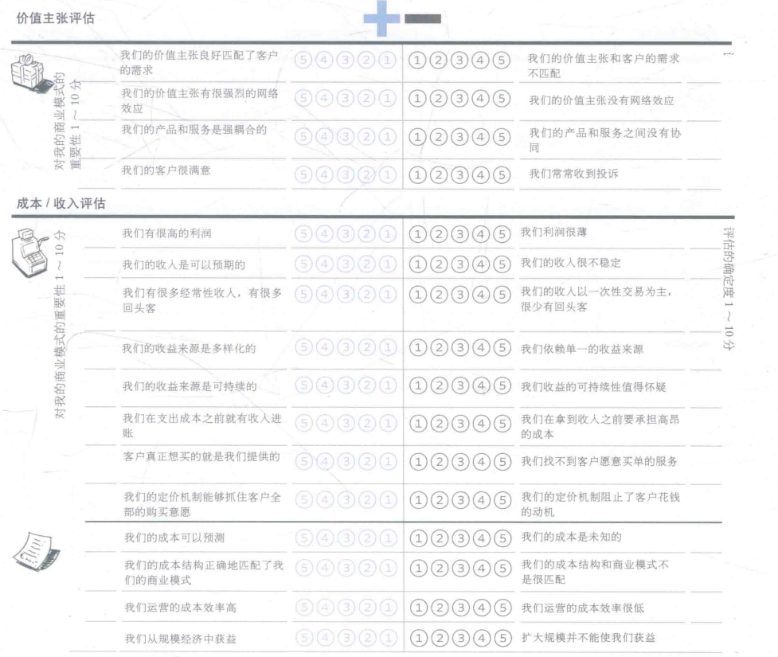
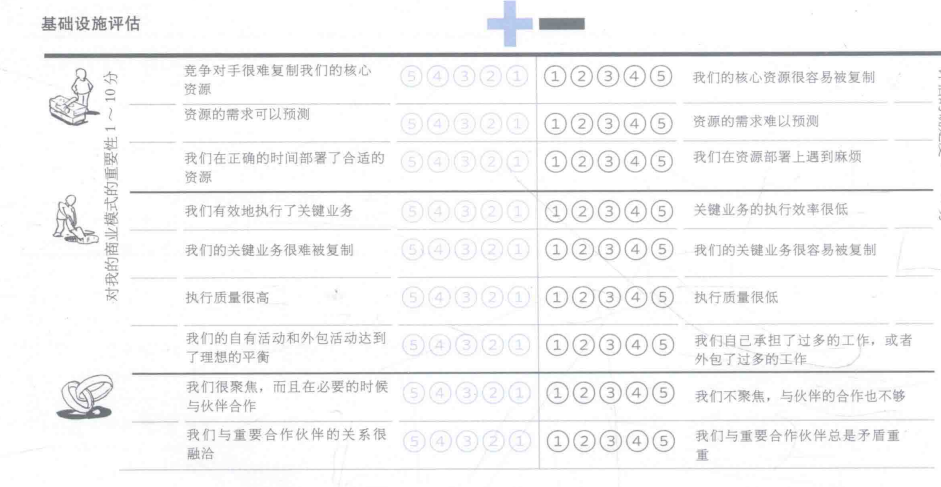
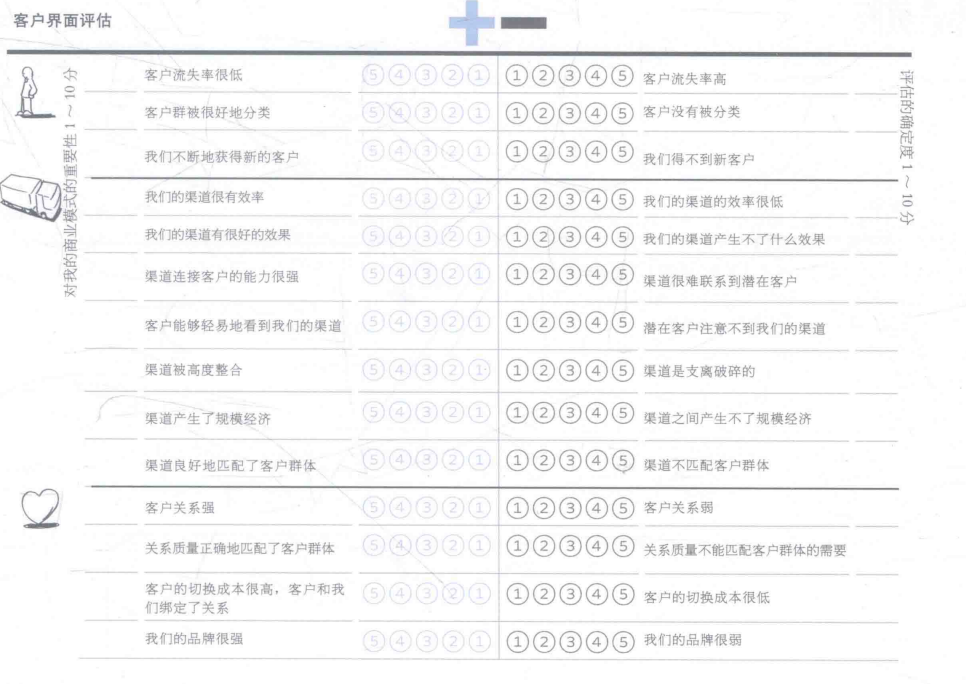
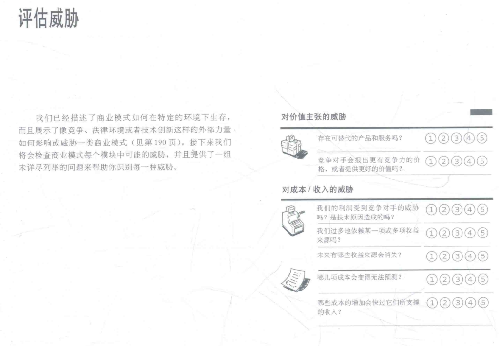
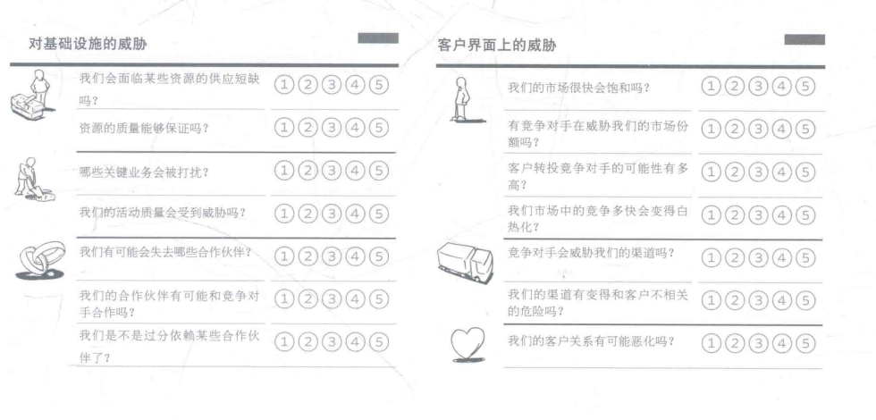
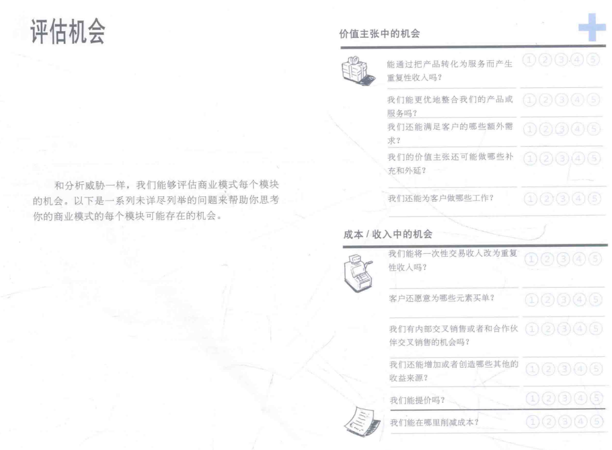
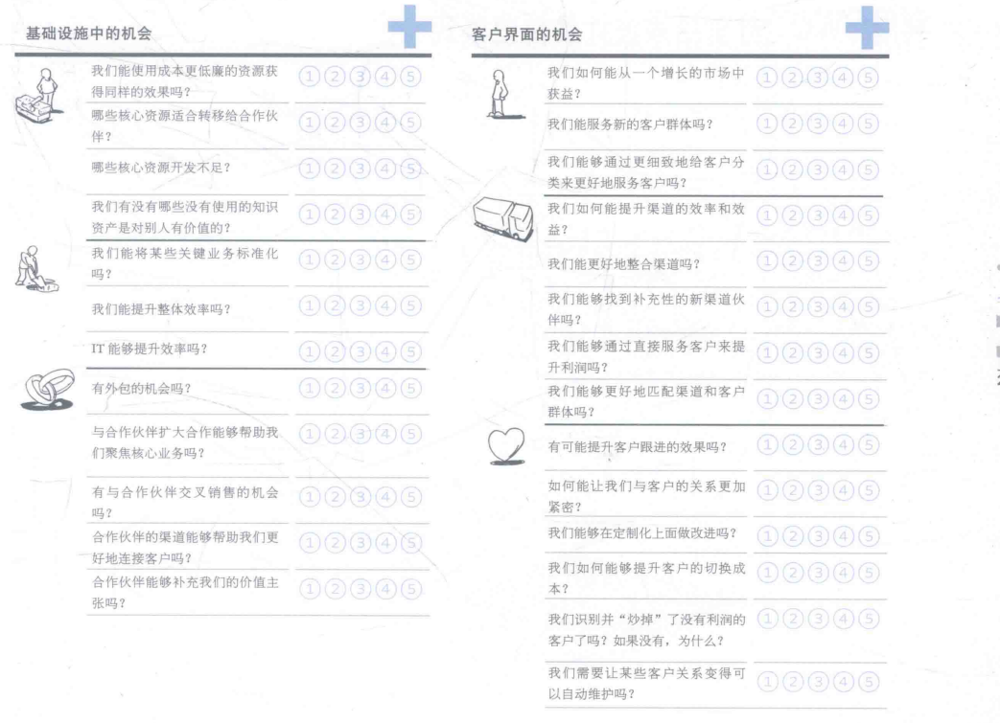

## Lab2-商业模式评估

[TOC]

⚠$\textcolor{red}{商业模式环境、总体评估、SWOT均针对竞品，仅蓝海战略针对自身}$

### 1 商业模式评估简介

#### 1.1 组员信息

| 姓名   | 学号      |
| ------ | --------- |
| 张铭铭 | 211250236 |
| 陈皓鑫 | 211250234 |
| 张哲恺 | 211250245 |

#### 1.2 工作概要

在这一阶段，我们从市场影响力、行业影响力、关键趋势、宏观经济影响四个方面对外部环境进行了评估；然后，我们使用总体评估和SWOT分析对上一阶段的竞品美图秀秀的商业模式进行了评估，找到了更新的切入点；最后，结合前两个部分的成果和蓝海战略的商业分析手段，我们对竞品的商业模式画布进行了迭代更新。

#### 1.3 度量数值

### 2 商业模式环境

#### 2.1 市场影响力

#### 2.1.1 市场问题

##### 2.1.1.1 影响客户环境的关键问题有哪些？

##### 2.1.1.2 哪些改变正在发生？

##### 2.1.1.3 市场将走向何处？

#### 2.1.2 市场分类

##### 2.1.2.1 哪些是重要的客户群体？

##### 2.1.2.2 哪个群体的增长潜力最大？哪些群体在缩小？

##### 2.1.2.3 哪些边缘群体值得留意？

#### 2.1.3 需求和诉求

##### 2.1.3.1 客户需要什么？客户真正想要搞定什么？

##### 2.1.3.2 没有被满足的客户需求里哪个最值得关注？

##### 2.1.3.3 哪些需求在增加？哪些在减少？

#### 2.1.4 切换成本

##### 2.1.4.1 哪些东西将客户捆绑在一家供应商和它的服务上？

##### 2.1.4.2 哪些切换成本阻止客户转投竞争对手？

##### 2.1.4.3 客户容易找到并采购类似的服务吗？

##### 2.1.4.4 品牌有多重要？

#### 2.1.5 收入吸引力

##### 2.1.5.1 客户真正愿意花钱买的是什么？

##### 2.1.5.2 利润中最大的一块从哪里获得？

##### 2.1.5.3 客户能够轻易地找到并购买更便宜的产品和服务吗？

#### 2.2 行业影响力

##### 2.2.1 （现有）竞争对手

##### 2.2.1.1 哪些是我们领域的主导者和竞争对手？

##### 2.2.1.2 竞争者的竞争优势和劣势分别是什么？

##### 2.2.1.3 竞争者有哪些产品和服务？它们聚焦于哪些客户群体？成本结构如何？

##### 2.2.1.4 竞争者对我们的客户群体、收益来源和利润有什么影响？

#### 2.2.2 新进入者（挑战者）

##### 2.2.2.1 谁是市场的新进入者？它们之间有什么不同？

##### 2.2.2.2 新进入者有哪些优势和劣势？

##### 2.2.2.3 新进入者必须要克服哪些障碍？它们的成本结构与价值主张如何？聚焦哪些客户群体？

##### 2.2.2.4 新进入者对我们的客户群体、收益来源和利润有什么影响？

#### 2.2.3 替代产品和服务

##### 2.2.3.1 哪些产品和服务能够替代我们的产品和服务？

##### 2.2.3.2 它们的成本与我们的相差多少？

##### 2.2.3.3 客户要切换到这些替代品有多容易？

##### 2.2.3.4 这些替代产品起源于何种商业模式传统？

#### 2.2.4 供应商和价值链上的其他厂商

##### 2.2.4.1 谁是你的行业价值链中的关键玩家？

##### 2.2.4.2 你的商业模式在多大程度上依赖这些关键玩家？

##### 2.2.4.3 有边缘玩家在涌现吗？谁的利润最高？

#### 2.2.5 利益相关者

##### 2.2.5 哪些利益相关者会影响你的商业模式？他们的影响力如何？

（eg. 股东，员工，政府，游说者）

### 2.3 关键趋势

#### 2.3.1 技术趋势

##### 2.3.1.1 你的市场内外的主要技术趋势有哪些？

##### 2.3.1.2 哪些技术代表了重要的机会或者颠覆性的威胁？

##### 2.3.1.3 哪些新兴技术是边缘客户正在逐步采用的？

#### 2.3.2 行业管理趋势

##### 2.3.2.1 哪些管理趋势会影响你的市场？

##### 2.3.2.2 哪些规则会影响你的商业模式？

##### 2.3.2.3 哪些管理规定和税费会影响客户需求？

#### 2.3.3 社会和文化趋势

##### 2.3.3.1 社会的关键趋势是什么？

##### 2.3.3.2 文化或社会价值观上的哪些变化会影响你的商业模式？

##### 2.3.3.3 哪些趋势会影响购买者的行为？

#### 2.3.4 社会经济趋势

##### 2.3.4.1 关键人口统计学趋势有哪些？

##### 2.3.4.2 市场中收入和财富的分布有哪些特征？

##### 2.3.4.3 所处市场的消费特征是什么？

##### 2.3.4.4 城镇人口相对于农村人口的比例如何？

### 2.4 宏观经济影响

#### 2.4.1 全球市场情况

##### 2.4.1.1 经济是否处于爆发期？总体市场情绪如何？

##### 2.4.1.2 GDP增长率如何？

##### 2.4.1.3 失业率有多高？

#### 2.4.2 资本市场

##### 2.4.2.1 资本市场处于什么状态？

##### 2.4.2.2 所处市场中获得投资有多容易？现在就能获得种子资本、创业资本、 众筹、市场资本或者贷款吗？获得这些投资的成本有多高？

#### 2.4.3 大宗商品和其他资源

##### 2.4.3.1 业务必备的大宗商品和其他资源的当前市场状态如何？

##### 2.4.3.2 执行商业模式所需资源有多么容易获取？成本如何？价格走向如何？

#### 2.4.4 经济基础设施

##### 2.4.4.1 所处市场的公共基础设施有多优良？

##### 2.4.4.2 你如何评价交通、贸易、学校质量，以及连接供应商和客户的便利度？

##### 2.4.4.3 个人和企业的税费有多高？

##### 2.4.4.4 对商业组织的公共服务有多好？

##### 2.4.4.5 你如何评价这里的生活质量？

### 3 评估商业模式-总体评估

⚠$\textcolor{red}{每个至少3项，总体至少8项}$

#### 3.1 一阶段商业模式画布

#### 3.2 加分项

#### 3.3 减分项

#### 3.4 我们的创意核心

⚠$\textcolor{red}{结合竞品特点、外部环境和总体评估的结果，论述价值主张、成本收入、基础设施、客户界面中哪一类是创意核心}$

### 4 评估商业模式-SWOT分析

⚠$\textcolor{red}{打分并论述理由}$

#### 4.1 优势/劣势评估

#### 4.2 威胁评估

#### 4.3 机会评估

### 5 蓝海战略

⚠$\textcolor{red}{从成本影响、价值主张、对客户的影响这三个方向中挑选一个方向,并结 合已有的内容解释为何优先选择该方向}$

### 6 更新后的商业模式画布

### 7 参考文献

