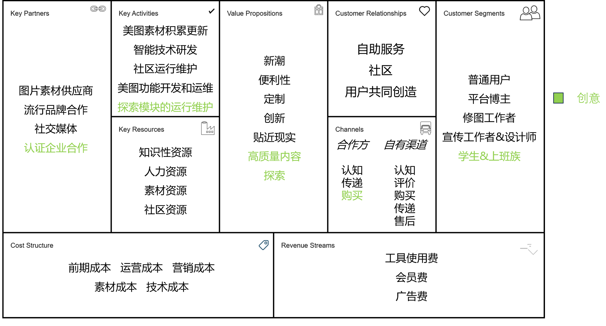

## Lab2-商业模式评估

[TOC]

⚠$\textcolor{red}{商业模式环境、总体评估、SWOT均针对竞品，仅蓝海战略针对自身}$

### 1 商业模式评估简介

#### 1.1 组员信息

| 姓名   | 学号      |
| ------ | --------- |
| 张铭铭 | 211250234 |
| 陈皓鑫 | 211250236 |
| 张哲恺 | 211250245 |

#### 1.2 工作概要

在上一阶段，我们针对“美图秀秀”这一竞品进行了相关讨论。在这一阶段，我们完成商业模式环境分析、总体评估、SWOT分析、蓝海战略等工作，并对商业模式画布进行更新。

#### 1.3 度量数值

### 2 商业模式环境

#### 2.1 市场影响力

#### 2.1.1 市场问题

##### 2.1.1.1 影响客户环境的关键问题有哪些？

对于本领域而言，此处的客户环境体现在“美图秀秀”所处的图片美化应用、社交软件的相关市场。此处应该聚焦于在哪些问题正在深刻影响着这类市场。

- 国家政策对于网络言行、虚拟社交等方面进行的相关管控1
- 大众群体对于美的重视程度
- 大众对于分享美图、将美图用于社交的意愿
- 大众群体对于图片美化软件的认可程度和使用意愿

##### 2.1.1.2 哪些改变正在发生？

- 在社会大环境下，国家对于网络言行等方面的管控力度不断加强，图片审核、社交言论等方面推出更严格的监管举措。1
- “颜值即是正义”的观念愈加深入人心，逐渐出现了“颜值焦虑”“审美焦虑”等现象。2
- 网络的社交属性不断增强，通过图片表达进行表达和社交日益丰富。
- 更多的用户群体不再满足图片本身，更愿意通过进一步美化图片来达到自己的需要。3

##### 2.1.1.3 市场将走向何处？

- 新兴美图形式，例如美图与AI相结合正在变得更加重要4
- 美图、社交、视频、直播等形式的融合将会更加深入
- 从“虚拟美”走向“真实美”5

#### 2.1.2 市场分类

##### 2.1.2.1 哪些是重要的客户群体？

这个问题体现在本领域中的用户细分这一块。需要认真考虑产品的用户群体及特点。

- 一般意义上的大众用户群体
- 年龄较小（18-35）的女性用户群体6
- 通过社交平台分享获取流量或者收益的博主
- 致力于图片美化的修图工作者
- 与图片使用相关的宣传工作者和设计师
- ？

##### 2.1.2.2 哪个群体的增长潜力最大？哪些群体在缩小？

- 年龄较小（18-35）的女性用户群体6的增长潜力最大。
- 与图片使用相关的宣传工作者和设计师这类群体在缩小7。

##### 2.1.2.3 哪些边缘群体值得留意？

- 通过社交平台分享获取流量或者收益的博主需要留意。与大众群体不同，这类人群基数不大，但需求更加多样化、个性化，更加注重对于图片的美化程度和表达效果等。
- ？

#### 2.1.3 需求和诉求

##### 2.1.3.1 客户需要什么？客户真正想要搞定什么？

在本领域，搞清楚客户需要什么与“美图秀秀”的核心功能以及价值主张是密切相关的，前者相当于后者的“风向标”。

客户需要的是能够让图片美化更加简单、快捷、高效的工具，通过这个工具，客户真正想要搞定的是：

- 满足自己的表达欲和分享欲
- 分享图片获得更多的流量和收益
- 向他人通过图片的方式传达自己的想法、观点、状态甚至情感

##### 2.1.3.2 没有被满足的客户需求里哪个最值得关注？

##### 2.1.3.3 哪些需求在增加？哪些在减少？

#### 2.1.4 切换成本

##### 2.1.4.1 哪些东西将客户捆绑在一家供应商和它的服务上？

##### 2.1.4.2 哪些切换成本阻止客户转投竞争对手？

##### 2.1.4.3 客户容易找到并采购类似的服务吗？

##### 2.1.4.4 品牌有多重要？

#### 2.1.5 收入吸引力

##### 2.1.5.1 客户真正愿意花钱买的是什么？

##### 2.1.5.2 利润中最大的一块从哪里获得？

##### 2.1.5.3 客户能够轻易地找到并购买更便宜的产品和服务吗？

#### 2.2 行业影响力

##### 2.2.1 （现有）竞争对手

##### 2.2.1.1 哪些是我们领域的主导者和竞争对手？

##### 2.2.1.2 竞争者的竞争优势和劣势分别是什么？

##### 2.2.1.3 竞争者有哪些产品和服务？它们聚焦于哪些客户群体？成本结构如何？

##### 2.2.1.4 竞争者对我们的客户群体、收益来源和利润有什么影响？

#### 2.2.2 新进入者（挑战者）

##### 2.2.2.1 谁是市场的新进入者？它们之间有什么不同？

##### 2.2.2.2 新进入者有哪些优势和劣势？

##### 2.2.2.3 新进入者必须要克服哪些障碍？它们的成本结构与价值主张如何？聚焦哪些客户群体？

##### 2.2.2.4 新进入者对我们的客户群体、收益来源和利润有什么影响？

#### 2.2.3 替代产品和服务

##### 2.2.3.1 哪些产品和服务能够替代我们的产品和服务？

##### 2.2.3.2 它们的成本与我们的相差多少？

##### 2.2.3.3 客户要切换到这些替代品有多容易？

##### 2.2.3.4 这些替代产品起源于何种商业模式传统？

#### 2.2.4 供应商和价值链上的其他厂商

##### 2.2.4.1 谁是你的行业价值链中的关键玩家？

##### 2.2.4.2 你的商业模式在多大程度上依赖这些关键玩家？

##### 2.2.4.3 有边缘玩家在涌现吗？谁的利润最高？

#### 2.2.5 利益相关者

##### 2.2.5 哪些利益相关者会影响你的商业模式？他们的影响力如何？

（eg. 股东，员工，政府，游说者）

### 2.3 关键趋势

#### 2.3.1 技术趋势

##### 2.3.1.1 你的市场内外的主要技术趋势有哪些？

##### 2.3.1.2 哪些技术代表了重要的机会或者颠覆性的威胁？

##### 2.3.1.3 哪些新兴技术是边缘客户正在逐步采用的？

#### 2.3.2 行业管理趋势

##### 2.3.2.1 哪些管理趋势会影响你的市场？

##### 2.3.2.2 哪些规则会影响你的商业模式？

##### 2.3.2.3 哪些管理规定和税费会影响客户需求？

#### 2.3.3 社会和文化趋势

##### 2.3.3.1 社会的关键趋势是什么？

##### 2.3.3.2 文化或社会价值观上的哪些变化会影响你的商业模式？

##### 2.3.3.3 哪些趋势会影响购买者的行为？

#### 2.3.4 社会经济趋势

##### 2.3.4.1 关键人口统计学趋势有哪些？

##### 2.3.4.2 市场中收入和财富的分布有哪些特征？

##### 2.3.4.3 所处市场的消费特征是什么？

##### 2.3.4.4 城镇人口相对于农村人口的比例如何？

### 2.4 宏观经济影响

#### 2.4.1 全球市场情况

##### 2.4.1.1 经济是否处于爆发期？总体市场情绪如何？

##### 2.4.1.2 GDP增长率如何？

##### 2.4.1.3 失业率有多高？

#### 2.4.2 资本市场

##### 2.4.2.1 资本市场处于什么状态？

##### 2.4.2.2 所处市场中获得投资有多容易？现在就能获得种子资本、创业资本、 众筹、市场资本或者贷款吗？获得这些投资的成本有多高？

#### 2.4.3 大宗商品和其他资源

##### 2.4.3.1 业务必备的大宗商品和其他资源的当前市场状态如何？

##### 2.4.3.2 执行商业模式所需资源有多么容易获取？成本如何？价格走向如何？

#### 2.4.4 经济基础设施

##### 2.4.4.1 所处市场的公共基础设施有多优良？

- 我国IT行业基础设施提供商众多，市场规模巨大。行业处于快速扩张阶段，能够提供多种高质量服务。
- 我国IT行业基础设施提供商众多，市场规模巨大。行业处于快速扩张阶段，能够提供多种高质量服务。

##### 2.4.4.2 你如何评价交通、贸易、学校质量，以及连接供应商和客户的便利度？

我们认为交通这一因素与我们的商业模式关系不大，因此不予考虑。

##### 2.4.4.3 个人和企业的税费有多高？

- 居民企业的所得税为25%，小微企业所得税为20%，国家需要重点扶持的高新技术企业所得税为15%。
- 居民企业的所得税为25%，小微企业所得税为20%，国家需要重点扶持的高新技术企业所得税为15%。

##### 2.4.4.4 对商业组织的公共服务有多好？

- 国家开展清朗行动，打击假冒APP，小程序等，清理虚假信息，保障互联网企业权利。
- 我国互联网领域法治不断健全、监管不断完善，这为互联网企业加强管理、规范运营提供了有力保障。相关部门通过加强惠企政策统筹协调等方式，为广大互联网企业健康持续发展提供有力保障。
- 国家开展清朗行动，打击假冒APP，小程序等，清理虚假信息，保障互联网企业权利。
- 我国互联网领域法治不断健全、监管不断完善，这为互联网企业加强管理、规范运营提供了有力保障。相关部门通过加强惠企政策统筹协调等方式，为广大互联网企业健康持续发展提供有力保障。

##### 2.4.4.5 你如何评价这里的生活质量？

- 我国居民生活质量相较十年前有较大提升，发展型享受型消费日益提升。
- 我国城乡基础设施建设不断完善，居住条件得到改善。
- 配套医疗服务和教育服务水平提高。- 我国居民生活质量相较十年前有较大提升，发展型享受型消费日益提升。
- 我国城乡基础设施建设不断完善，居住条件得到改善。
- 配套医疗服务和教育服务水平提高。

### 3 评估商业模式-总体评估

⚠$\textcolor{red}{每个至少3项，总体至少8项}$

#### 3.1 一阶段商业模式画布

#### 3.2 加分项

#### 3.3 减分项

#### 3.4 我们的创意核心

⚠$\textcolor{red}{结合竞品特点、外部环境和总体评估的结果，论述价值主张、成本收入、基础设施、客户界面中哪一类是创意核心}$

### 4 评估商业模式-SWOT分析

⚠$\textcolor{red}{打分并论述理由}$

#### 4.1 优势/劣势评估

#### 4.2 威胁评估

#### 4.3 机会评估

### 5 蓝海战略

⚠$\textcolor{red}{从成本影响、价值主张、对客户的影响这三个方向中挑选一个方向,并结 合已有的内容解释为何优先选择该方向}$

### 6 更新商业模式画布

#### 6.1 更新后的商业模式画布

#### 6.2 更新后的画布优点

### 7 参考文献

1. [国家对网络言论的管控](https://www.zhihu.com/question/50273830/answer/121474949)
2. [如何看待美图公司的发展前景？](https://www.zhihu.com/?url=https%3A%2F%2Fwww.zhihu.com%2Fquestion%2F50273830)
3. 
4. 
5. 
6. [回顾10年变迁史，探究美图商业化背后逻辑](https://zhuanlan.zhihu.com/?url=https%3A%2F%2Fzhuanlan.zhihu.com%2Fp%2F55944077)
7. [预见2022：《2022年中国IT基础设施行业全景图谱》](https://baijiahao.baidu.com/s?id=1729236775186636497&wfr=spider&for=pc)
8. [中华人民共和国企业所得税法](www.chinatax.gov.cn/chinatax/n810341/n810825/c101434/c28479830/content.html)
9. [中央网信办开展专项行动优化营商网络环境](https://www.gov.cn/zhengce/2023-04/28/content_5753674.htm)
10. [中央网信办：将为互联网企业健康持续发展提供有力保障](https://www.gov.cn/xinwen/2022-01/29/content_5671225.htm)
11. [居民收入水平较快增长 生活质量取得显著提高——党的十八大以来经济社会发展成就系列报告之十九
](http://www.stats.gov.cn/sj/sjjd/202302/t20230202_1896697.html)

7. [预见2022：《2022年中国IT基础设施行业全景图谱》](https://baijiahao.baidu.com/s?id=1729236775186636497&wfr=spider&for=pc)
8. [中华人民共和国企业所得税法](www.chinatax.gov.cn/chinatax/n810341/n810825/c101434/c28479830/content.html)
9. [中央网信办开展专项行动优化营商网络环境](https://www.gov.cn/zhengce/2023-04/28/content_5753674.htm)
10. [中央网信办：将为互联网企业健康持续发展提供有力保障](https://www.gov.cn/xinwen/2022-01/29/content_5671225.htm)
11. [居民收入水平较快增长 生活质量取得显著提高——党的十八大以来经济社会发展成就系列报告之十九
](http://www.stats.gov.cn/sj/sjjd/202302/t20230202_1896697.html)
