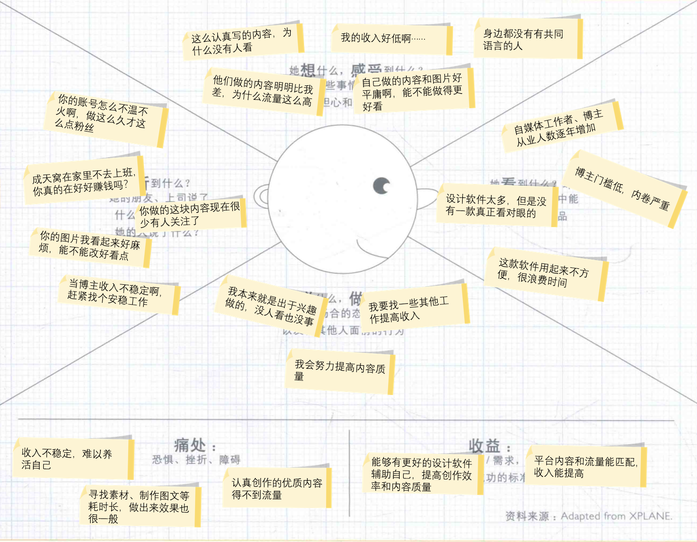

## Lab3 商业模式设计

### 1 商业模式设计简介

#### 1.1 组员信息

|      姓名      |   学号    |
| :------------: | :-------: |
| 张铭铭（队长） | 211250234 |
|     陈皓鑫     | 211250236 |
|     张哲恺     | 211250245 |

#### 1.2 工作概要

1. 本次作业设计的商业模式源于上一次作业，对其内容做出了%的调整；
2. 全文包括客户洞察、构思、视觉化思考、模型构建、讲故事、场景六个部分；
3. 视觉化讲述商业模式部分的[视频链接]()👈

#### 1.3 度量数值

本次作业的内容包括：

1. 客户洞察部分的移情图共3个；
2. 构思部分的候选创意共5个；
3. 模型构建部分更新的画布要点数量共30个，关联关系共15个；
4. 讲故事部分的故事共2个；
5. 场景部分要点共6个。

### 2 客户洞察

#### 2.1 宣传工作者&设计者

此类用户主要是企业或机构中从事平面设计工作的用户，负责设计海报等内容。

##### 2.1.1 统计特征

我国平面设计师人数已经达到187万人，主要分布在经济发达地区、沿海区域和省会城市，平均收入约1万元，平均工作时长约7年。按照如今的行业发展趋势，有相当一部分非专业设计师群体进入了该行业，并且企业，尤其是中小型企业对设计工作人员提出了更多的要求，包括兼职运营，客服等工作。

##### 2.1.2 移情图

随着当今信息的海量化与碎片化，要吸引人们的眼球，让人们留下深刻的印象给平面设计工作的人员的创意、设计方案提出了不小的挑战。但在重复的工作、美术素材和其他工作的压力下，设计出让人眼前一亮的内容常常让平面设计人员焦头烂额。M·A·P可以解决平面设计工作人员的难题，它的社区能持续输送新潮、高质量的素材内容；它还能根据图片和文字素材自动生成设计结果，为设计工作人员提供灵感；同时，它的设计模块简洁易用，能帮助设计人员快速确定设计方案是否可行，甚至直接产生最终结果。

#### 2.2 普通用户

此类用户主要是使用设计工具进行图片处理、通过社区获取内容的一般用户。

##### 2.2.1 统计特征

我国网民数量已经达到10.51亿，互联网普及率达到74.4%，人均每周上网时长为29.5小时，使用手机上网的比例达到99.6%。而在2019年12月，使用美颜拍摄类APP的月活用户就达到了3亿人。

##### 2.2.2 移情图

随着全民分享时代的到来，越来越多的人愿意在自己的圈子中分享自己的生活剪影，对这些剪影图片的处理也成为了分享过程中很重要的一部分。但水涨船高的朋友圈质量也造就了一部分用户因自己的分享质量不高而怯于分享自己的生活内容，想要跟随主流学习简单的图片处理也会发现界面过于复杂，学习成本过高。进而造成了存在感缺失、周围人对其人格的误解等问题。M·A·P可以帮这些用户快速简单地生成初步P图结果，用户可以方便地修改这些初步结果；同时，它的社区还能为这些用户提供时新的框架模板，解决处理方式老套的问题。

#### 2.3 平台博主

此类用户主要是在多边平台上发布内容的博主，他们的收入主要来自于平台的流量分成。

##### 2.3.1 统计特征

包括小红书、抖音、快手、微博、B站等多边平台在内，平台内各博主数量已经达到了千万人以上。越来越多的人加入了自媒体行业，成为了平台博主，以图文、音频或视频内容等各类形式在平台发布信息内容并依此获得收益。

##### 2.3.2 移情图

在全民分享时代，由于门槛较低，越来越多的人开始兼职起平台博主，全职博主更是大有人在。但用户的浏览量是有限的，博主与博主之间需要相互竞争争夺用户流量，一个博主是否成功，往往是以流量作为衡量的指标，如果博主会蹭热度，懂得怎么利用热点抓住用户，那他往往会收获更多的关注度。而那些深耕某个领域，埋头进行优质内容的博主却常常存在感低下，得不到用户浏览，更拿不到相应的收入。这种倒置现象增加了消磨了博主创作的热情，在这样的环境下，博主很难坚持本心完成高质量创作，往往会投身“恰流量”的队列，而这又加剧了流量至上的观念，形成了一个恶性循环。而M·A·P的社区致力于完成流量和内容质量的强绑定，对于那些分享优质内容的博主，会提供更多的推流机会。另外，认真完成一次内容创作需要花费大量的时间，特别是在制作、排版一些图片的时候，不熟悉的工作领域进一步消磨了博主的耐心。而M·A·P提供的智能化生成工具以及丰富的模板素材在为博主的内容创作提供灵感的同时，进一步简化了博主的工作，让博主不用再囿于制作plog、排版图片等方面的短板。

### 3 构思

#### 3.1 创意一

##### 3.1.1 驱动因素

客户驱动

##### 3.1.2 如果…会怎样

如果我们将企业的企宣工作人员也纳入客户群体会怎么样？

##### 3.1.3 对商业模式画布的影响

企业的企宣工作中重要的一环就是对外宣传自己企业的企划。在现有的多边平台上，平台的博主通过接取企宣的广告获得收益，并在制作的内容中为企业进行推广已经形成了较好的经济循环链条，也在相当程度上受到了用户的支持。因此，将企业的企宣人员加入客户群体，为他们认证相关企业的官方账号，以创建更完整的社交平台生态，同时有益于与更多的企业展开合作，扩展平台的影响力。

该创意会对商业模式画布产生如下影响：

1. 客户细分中加入企业企宣工作人员
2. 关键合作中加入认证企业合作

#### 3.2 创意二

##### 3.2.1 驱动因素

供给驱动

##### 3.2.2 如果…会怎样

如果我们为用户提供去流量化的平台会怎么样？

##### 3.2.3 对商业模式画布的影响

在流量为王的时代背景下，流量几乎成为了衡量博主与内容成功与否的首屈一指的指标，然而，因为蹭热度、蹭流量内容的出现，流量与内容的质量常常没有明确的关系。这种倒置现象增加了用户有明确目的时获取有效内容的难度，也消磨了博主创作的热情，打击分享欲望。因此，将高质量内容加入价值主张，为用户提供流量与用户反馈高度绑定的去流量化社交平台，既有利于用户寻找高质量的相关内容，激发用户分享欲望，也有利于激励博主继续创作优质内容。

该创意会对商业模式画布产生如下影响：

1. 价值主张中加入高质量内容
2. 社区资源的质量将得到提高
3. 运营成本将会提高

#### 3.3 创意三

##### 3.3.1 驱动因素

资源驱动

##### 3.3.2 如果…会怎样

如果我们抛弃与图片素材提供商的合作会怎么样？

##### 3.3.3 对商业模式画布的影响

图片素材不一定需要依靠相关提供商。倘若抛弃与图片素材提供商的合作，我们仍然有许多途径可以获得我们的素材，用于产品的功能和产品智能模型的训练：网络上可以找到许多优质且免费的素材资源，这一部分内容实际上已经足够多；公司内部的设计师可以参与创造，制作新的模板和素材；用户实际上是一块巨大的潜在素材来源。在创作时，用户可以自行创造出自己想要的素材，或者是将一些已有元素重新排列组合，并不需要使用现成的资源。并且，借助社区，用户之间可以相互进行分享，共同创造，打造出一种“取之于用户，用之于用户”的状态。因此，抛弃与图片素材商的合作是完全可行的，并可以进一步优化成本结构，同时强化社区理念，提升用户共同创造。

该创意会对商业模式画布产生如下影响：

1. 关键合作中删去图片素材供应商
2. 成本结构中素材成本减少，运营成本增加
3. 客户关系中社区和用户共同创造将会提高

#### 3.4 创意四

##### 3.4.1 驱动因素

供给驱动

##### 3.4.2 如果…会怎样

如果我们促使用户脱离自己的舒适圈，去看一看更多的冷门小众内容会怎么样？

##### 3.4.3 对商业模式画布的影响

当下互联网住民，都安稳地躺在自己的舒适圈中，刷着自己已经习以为常的内容。虽然这并不坏，但这也限制了用户的视野，使用户陷入信息茧房。为此，我们在价值主张中新增“打破舒适圈”。具体来说，新增探索新内容模块，将用户自行选择探索新内容转为主动引导用户浏览自己以前从未接触过的内容，让用户拓宽自己的“MAP”，去浏览冷门小众内容，发现未知的、充满惊喜的领域。在该模块里，可以抛弃传统的推荐算法，将用户与冷门小众博主进行匹配，让用户每个人人都有属于自己的“MAP”，同时也能够帮助冷门小众博主获得更多的流量。

该创意会对商业模式画布产生如下影响：

1. 价值主张中新增打破舒适圈
2. 客户关系中社区将会提高
3. 关键业务中增加对探索新内容的模块运行维护

#### 3.5 创意五

##### 3.5.1 驱动因素

客户驱动

##### 3.5.2 如果…会怎样

如果我们将用户群体扩展学生，上班族群体会怎么样？

##### 3.5.3 对商业模式画布的影响

随着时代的发展，许多学生与上班族面临着很多小组讨论，展示进度，协同合作，汇报情况等需要交流沟通汇报的情况，这时候就需要 pdf, ppt 等图文内容进行展示，制作这类演示需要花费大量的精力，时间以及学习成本，但不是学习与工作的重点,这类用户的痛点是难以制作出精美的演示图文，或是制作精良的内容会付出较多的时间成本。我们可以尝试提供模板和AI生成工具等服务。学生群体和上班族尝试新产品的意愿强烈，同时也愿意为这种工具付费。

该创意会对商业模式画布产生如下影响：

1. 客户细分中加入学生，上班族
2. 收入来源中使用费将会提高

#### 3.6 最终商业模式创意

小组经过讨论决定：整合创意二和创意四，保留创意五，调整并保留创意一，创意三不予采纳。下面是最终创意的具体描述。

##### 3.6.1 调整后的创意一

调整后，商业模式画布更新如下：

- 关键合作将增加一项：认证企业合作。
- 渠道通路中合作方增加：购买。

原本的创意一中，“客户细分增加企业企宣工作人员”其实没有必要，且创意平平，给企宣工作人员加一些认证等是一件很自然的事情，目前各类主流社交平台如微博、b站等，以及美图秀秀等均有类似的蓝v认证。创意一更侧重于与企业之间的交互，核心是与企业之间的合作。因此，关键合作中加入认证企业合作，邀请一些企业的宣传人员进入我们的社区，认证他们的官方账号，以此来扩展我们的社区生态，同时也有利于与更多的企业展开合作，扩展平台的影响力。

##### 3.6.2 整合后的创意二和创意四

整合后，商业模式画布更新如下：

- 价值主张将新增两项：高质量内容和打破舒适圈。
- 关键业务中将增加一项：探索新内容的模块运行维护。

创意二和创意四的核心其实是相同的：去流量化。其实这里的“去流量化”更多是一种追求质量和流量绑定的理念，改变传统的热点、通俗内容有更多流量、“看得越多看得越多”的模式。我们将高质量内容和打破舒适圈加入价值主张，鼓动用户踏出熟悉的领域和那些通俗热点，去浏览那些自己不熟悉的、宝藏但冷门的那些内容。这也帮助那些在冷门领域深耕的博主获得更多关注度，提高博主的创作热情，使得社区资源的质量得到提高。籍由此，客户关系中社区将得到提高，核心资源中社区资源的质量将得到提高，但成本结构中运营成本也会增加。另外，这是一项全新的模块，与现有的关键业务均不同，需要将其单独列出，作为“探索模块的运行维护”加入关键业务中，具体包括高质量内容、冷门内容的筛选推送，以及模块功能的运行和维护。

##### 3.6.3 创意五

商业模式画布中的客户细分中将加入：学生&上班族。

此处学生与上班族群体与现有画布中的客户群体有所不同，具体体现在用户的使用目的：学生和上班族使用本产品的目的是完成学习和工作中的一些任务如论文、汇报等；已有的客户细分中的普通用户更倾向于日常使用场景；设计师更强调产品设计，与学生、上班族需要完成的pdf、ppt等不同。这类需求在之前的商业模式画布中被忽略了，但实际上这类需求是存在的，而且这类用户对于新产品的接受度较高，愿意为这类工具付费，加入之后，收入来源中使用费会增加。

### 4 视觉化思考

#### 4.1 视觉化的商业模式画布

#### 4.2 分析说明

### 5 模型构建

#### 5.1 更新后的商业模式画布

#### 5.2 市场潜力预估

#### 5.3 模块联系

#### 5.4 支撑画布构建的基本事实

### 6 讲故事

#### 6.1 用户视角-学生

> 小明，南京大学软件学院本科生

小明是一个普普通通的南京大学软院学生（**客户细分：学生&上班族**）。小县城出生的他自诩“小镇做题家”，在强者如云的软院里存在感低下，成绩位居中流，既没有很突出的代码能力，也没有引以为傲的特长，在创作设计的履历上更是一片空白。进入大学之后，诸如ppt之类一些前所未闻的任务突然向他袭来，这些任务常常要用到PS、PowerPoint等很复杂的软件。此前少有接触电脑的小明光是熟悉软件就头昏脑胀，原本饶有兴致的他一下子感到压力山大。

这个学期，一门名叫《需求与商业模式创新》的课程又让小明头疼了起来。他发现，这门课程的大作业中涉及到许多图片制作相关的内容，像什么商业模式画布、移情图、可视化画布等等，这些都是他从未接触过的东西。无巧不成书，小组成员也没有人对制作这种东西有所了解，小明只能自己硬着头皮掏出PowerPoint开始制作。尽管小明花费了相当长的时间，不论是文字的排列还是整体的布局，都未能达到他所期望的美感。一些素材的欠缺更是让他颇感困扰，本以为应该全力以赴地创新商业模式，却意外地陷入了为寻觅完美图片而耗费心思的困境。愿景远大、目标明确的创新追求，却被琐碎细节所阻挠。这番挣扎让他深感无力，他发现每一个细节似乎都有着惊人的重要性。费尽心力，小明终于是完成了这门课程的大作业。最终大作业的分数平平无奇，也尚能说得过去，但不服输的小明仍对自己画的几个图片耿耿于怀。无法接受这一事实的他四下询问自己的同学，拿到了一些满分作业。打开一看，文字部分的精细程度且不说，那精致的图片、美观的排版差点让小明窒息——原来，自己才是小丑。

放假后，躺在床上的小明辗转反侧，久久不能释怀，空虚的无力感涌上了他的心头。难道就这样摆烂了吗？以后的课程任务还有很多，难道还要这样一次次地被打脸吗？以后还有这么多时间让我去搞这些设计的作业吗？他决心从这个假期开始改变自己。隔天，他虚心求教，向获得高分的小匡咨询一些独门绝技。小匡不紧不慢，只回了他三个字母：MAP。（**渠道通路：认知、传递**）小明一脸懵逼，正揣摩这是何种暗号之时，小匡紧接着娓娓道来：“你去下载一个叫MAP的设计软件，不是我做得好，而是它做得好！”抱着怀疑的心态，小明下载了那个名叫“M·A·P”的软件，刚一打开，他就被偌大一个“智能生成图片”的标题所吸引。寒假的招生宣讲材料还没完成呢，小明一边想着，一边打开这个功能，按照提示投喂了一些图片并给出简短的文字描述（**价值主张：便利性**），没过多久，系统就给出了生成完毕的提示（**用户关系：自助服务**）。导出来一看，小明惊呆了，简洁大方，美观大气，排版合理，这就是他昨晚做梦时梦里的ppt啊！小明的兴致一下子被点燃，他开始玩转相关功能，层出不穷的创意让小明赞不绝口（**价值主张：创新**）。过了好一阵子，小明正处在兴头上，突然发现试用次数用完了，他毫不犹豫地发动钞能力成为平台会员（**收入来源：会员费**，**渠道通路：购买**）。小明马不停蹄地开启自己的学习之旅，他又试了试近期热门的、产品主推的“智能生成plog”（**价值主张：新潮**），结果让他惊掉下巴，自己生成的plog和之前在小红书看到的简直别无两样，简直不敢相信这么优质的plog竟出自这样毫无经验的理工男之手。于是，小明与M·A·P结下了不解之缘，他一边学习设计，一边还在平台的社区发布了自己的第一个plog（**用户关系：社区**），获得了不少点赞和关注。在这个假期里，小明感觉自己焕然一新，终于和自己和解，对未来学习中的相关任务充满了信心。

#### 6.2 团队视角

> 小铭，M·A·P创始人

小铭，时年24岁，是从南京大学软件学院毕业的优秀学生。毕业之后，他对自己在《需求与商业模式创新》课程中提出的idea念念不忘，怀抱着这一理想，他募集了一群志同道合的小伙伴走上了创业之路。小铭靠着人脉募集资源和资金（**成本结构：前期成本**），将产品的关键技术攻关（**关键业务：智能技术研发**），形成了团队独特的技术资源（**核心资源：知识性资源**），一点点把功能做出来（**关键业务：美图功能开发和运维**）。历时两年半，小铭带领着团队，终于推出全新智能设计交流平台M·A·P。

M·A·P平台的诞生，让小铭感到无比欣慰。产品上线两三个月后，M·A·P平台的用户量稳定增加，已有的用户使用反馈也非常好，除此之外，团队也找到了许多设计师、工程师人才（**核心资源：人力资源**），这让小铭感到非常欣慰。但是随着时间继续推进，用户量的增加却越来越少。小铭本想安慰自己别急，但是看着购买素材和智能技术研发带来的高额支出（**成本结构：素材成本、技术成本**），他开始汗流浃背了。是什么原因导致了用户量的增长放缓？小铭冥思苦想未果，于是他召集核心人员开会讨论意见。外联工作的总负责人小张告诉小铭，尽管我们的产品新奇亮眼，但当下我们的合作伙伴只有部分素材版权方（**重要合作：图片素材供应商**），与主流社交市场联系不紧密，尚处于一种小众冷门产品的状态。

于是小铭大刀阔斧开始改革。小铭首先对社区“动刀”，提出了“打破舒适圈，探索新领域”的理念（**价值主张：探索**），鼓励用户从未曾涉及的领域中发掘惊喜，带领团队开发了全新板块（**关键业务：探索模块的运行维护**），意在鼓励用户之间的互联和推广。另外，在小铭的领导下，团队投入成本（**成本结构：营销成本**），增加与主流社交平台的合作，以此来扩大平台的影响力（**重要合作：社交媒体**）。他与其他平台的联系人展开谈判，M·A·P也在各主流媒体开设了自己的官号，大力宣传（**渠道通路：认知**）。一番努力之下终于有所成效，M·A·P平台的高质量内容（**价值主张：高质量内容**）和良好的社区（**核心资源：社区资源**）更吸引许多小企业主同开展合作（**重要合作：认证企业合作**），派企宣工作人员入驻平台，参与平台的创作和讨论中。

一番努力之下M·A·P的热度终于上去了。经过一段时间的沉淀，小铭觉得为时已到，紧接着如火如荼地开展与流行品牌的合作（**重要合作：流行品牌合作**，**渠道通路：认知、传递、购买**），将M·A·P的知名度进一步扩大，并和其他品牌互惠互赢。小铭相信，未来，M·A·P必定会铺展出更加绚丽多彩的画卷，传达出无穷的魅力。

#### 6.3 用户视角-普通用户

> 小茗，俏丽年轻的时尚少女

小茗，时年25岁，是一位俏丽年轻的时尚少女。

#### 6.4 用户视角-平台博主

> 小瞑，深耕wota艺领域的平台博主

### 7 场景

#### 7.1 

##### 7.1.1 场景描述

##### 7.1.2 独特性说明

